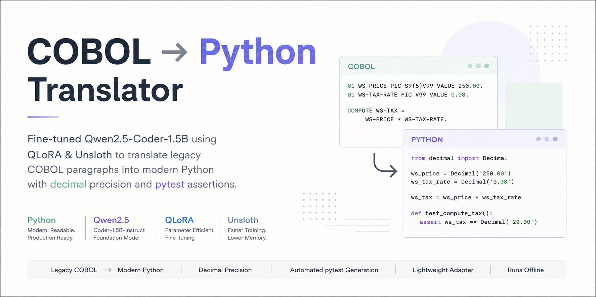

# COBOL → Python Translator

<p align="center">
  
</p>

Fine-tuning **Qwen2.5-Coder-1.5B-Instruct** with **QLoRA and Unsloth** to translate legacy COBOL paragraphs into modern Python while consistently using `decimal.Decimal` for arithmetic and generating `pytest` assertions for verification.

---

## Overview

COBOL continues to power many long-running enterprise systems, particularly in financial and business-critical environments. Modernizing these systems requires translating legacy code while preserving the original program logic and numerical behavior.

This project explores whether a relatively small code-specialized language model can be adapted for this narrow translation task using **parameter-efficient fine-tuning** rather than full model training.

The model is fine-tuned on **1,000 synthetic COBOL → Python instruction-following examples**.

The generated Python is designed to consistently:

* Use `decimal.Decimal` for numerical and financial calculations
* Translate common COBOL operations into modern Python
* Preserve the original computational logic
* Generate `pytest` assertions alongside the translated code
* Follow a consistent output format

The complete experiment was performed on **Google Colab using an NVIDIA Tesla T4 GPU**.

---

## Key Features

* **COBOL → Python translation**
* **Qwen2.5-Coder-1.5B-Instruct** as the base model
* **QLoRA** fine-tuning with 4-bit quantization
* **Unsloth** for memory-efficient training
* **LoRA adapters** instead of updating the full model
* `decimal.Decimal` for precise arithmetic
* Automatic `pytest` assertion generation
* Synthetic instruction-tuning dataset
* Local inference after fine-tuning

---

## Example

### Input — COBOL

```cobol
01 WS-PRICE PIC S9(5)V99 VALUE 250.00.
01 WS-TAX-RATE PIC V99 VALUE 0.08.

COMPUTE WS-TAX = WS-PRICE * WS-TAX-RATE.
```

### Generated Python

```python
from decimal import Decimal

ws_price = Decimal("250.00")
ws_tax_rate = Decimal("0.08")

ws_tax = ws_price * ws_tax_rate

def test_compute_tax():
    assert ws_tax == Decimal("20.00")
```

The generated code preserves the calculation while using `Decimal` instead of binary floating-point arithmetic.

---

## Model

| Component               | Configuration               |
| ----------------------- | --------------------------- |
| Base Model              | Qwen2.5-Coder-1.5B-Instruct |
| Loading Framework       | Unsloth                     |
| Fine-Tuning Method      | QLoRA                       |
| Quantization            | 4-bit                       |
| Maximum Sequence Length | 1024 tokens                 |
| Training Framework      | TRL                         |
| Training Method         | Supervised Fine-Tuning      |
| Adapter                 | LoRA                        |

The base model is loaded in 4-bit precision and remains frozen during training. Trainable LoRA adapters are added to selected transformer layers.

---

## LoRA Configuration

The following modules receive LoRA adapters:

| Target Module | Included |
| ------------- | :------: |
| `q_proj`      |     ✓    |
| `k_proj`      |     ✓    |
| `v_proj`      |     ✓    |
| `o_proj`      |     ✓    |
| `gate_proj`   |     ✓    |
| `up_proj`     |     ✓    |
| `down_proj`   |     ✓    |

### Adapter Parameters

| Parameter              |   Value |
| ---------------------- | ------: |
| LoRA Rank (`r`)        |      16 |
| LoRA Alpha             |      16 |
| LoRA Dropout           |       0 |
| Bias                   |  `none` |
| Gradient Checkpointing | Unsloth |
| Random Seed            |    3407 |

LoRA allows the model to be adapted without updating all parameters of the original 1.5B-parameter model.

---

# Dataset

The training dataset contains **1,000 synthetic COBOL → Python examples** stored in JSONL format.

Each line contains one conversation consisting of a user instruction and an assistant response.

### Dataset Format

```json
{
  "conversations": [
    {
      "role": "user",
      "content": "Translate this COBOL paragraph to modern Python..."
    },
    {
      "role": "assistant",
      "content": "from decimal import Decimal\n..."
    }
  ]
}
```

The dataset is formatted using the tokenizer's chat template before being passed to the trainer.

```python
def format_example(example):
    messages = example["conversations"]
    text = tokenizer.apply_chat_template(
        messages,
        tokenize=False
    )
    return {"text": text}
```

This allows the training examples to follow the same conversational format expected during inference.

---

## COBOL Constructs Covered

The synthetic dataset includes examples involving:

| Construct              | Examples                                        |
| ---------------------- | ----------------------------------------------- |
| Variable declarations  | `PIC`, `VALUE`                                  |
| Data movement          | `MOVE`                                          |
| Arithmetic             | `ADD`, `SUBTRACT`, `COMPUTE`                    |
| Division               | `DIVIDE`, `REMAINDER`                           |
| Conditions             | `IF`, `ELSE`                                    |
| Logical conditions     | `AND`                                           |
| Loops                  | `PERFORM UNTIL`                                 |
| Iterative loops        | `PERFORM VARYING`                               |
| Nested conditions      | Nested `IF / ELSE`                              |
| Arithmetic expressions | Addition, subtraction, multiplication, division |
| Decimal values         | `V99`, `S9(5)V99`, etc.                         |

The examples are intentionally focused on relatively small COBOL paragraphs rather than complete enterprise COBOL applications.

---

# Why `decimal.Decimal`?

Financial and business applications often require predictable decimal arithmetic.

Python's standard floating-point representation can introduce binary floating-point approximation. The project therefore instructs the model to use:

```python
from decimal import Decimal
```

and represent numerical values as:

```python
Decimal("1994.83")
```

rather than:

```python
1994.83
```

Arithmetic operations are consequently performed using `Decimal` objects:

```python
ws_base = Decimal("1994.83")
ws_deduct = Decimal("931.51")

ws_base = ws_base - ws_deduct
```

The dataset reinforces this behavior across the training examples.

---

# Why Generate `pytest` Assertions?

Translation alone is not enough for code modernization.

The generated test provides a basic verification mechanism for the translated calculation.

For example:

```python
def test_subtract_from():
    assert ws_base == Decimal("1063.32")
```

This gives the translated output an expected result that can be checked independently.

The generated assertions are intended as a starting point for verification rather than a replacement for comprehensive testing of production COBOL systems.

---

# Training Configuration

| Hyperparameter              |          Value |
| --------------------------- | -------------: |
| Dataset Size                | 1,000 examples |
| Epochs                      |              1 |
| Maximum Sequence Length     |           1024 |
| Per-device Batch Size       |              2 |
| Gradient Accumulation Steps |              4 |
| Effective Batch Size        |              8 |
| Learning Rate               |         `2e-4` |
| Warmup Ratio                |          `0.1` |
| Optimizer                   |    AdamW 8-bit |
| Weight Decay                |         `0.01` |
| LR Scheduler                |         Cosine |
| Precision                   |           FP16 |
| Logging Steps               |             10 |
| Random Seed                 |           3407 |

The effective batch size is obtained through gradient accumulation:

```text
2 × 4 = 8
```

This allows a larger effective batch without requiring the GPU to hold eight examples simultaneously.

---

# Training Environment

| Component          | Configuration         |
| ------------------ | --------------------- |
| Platform           | Google Colab          |
| GPU                | NVIDIA Tesla T4       |
| VRAM               | 16 GB                 |
| Model Loading      | 4-bit                 |
| Training Framework | TRL                   |
| Optimization       | Unsloth + 8-bit AdamW |
| Precision          | FP16                  |

The experiment was designed to demonstrate that parameter-efficient fine-tuning can be performed on relatively constrained GPU hardware.

---


# Training Output

The training process produces a LoRA adapter rather than a completely new copy of the base model.

Typical saved artifacts include:

```text
cobol_adapter/
├── adapter_config.json
├── adapter_model.safetensors
├── tokenizer_config.json
├── tokenizer.json
└── special_tokens_map.json
```

The adapter can then be loaded alongside the original Qwen2.5-Coder-1.5B-Instruct model for inference.

---

# Project Structure

```text
cobol-python-translator/
│
├── assets/
│   └── banner.png
│
├── dataset/
│   └── cobol_to_python_1000.jsonl
│
├── adapter/
│   ├── adapter_config.json
│   └── adapter_model.safetensors
│
├── notebook.ipynb
├── requirements.txt
├── README.md
└── LICENSE
```

> Update the structure above to match the final files committed to the repository.

---

# Installation

Clone the repository:

```bash
git clone https://github.com/dishantSasane/fine-tuning-.git
cd fine-tuning-
```

Install the required libraries:

```bash
pip install unsloth
```

For the complete environment used in the experiment:

```bash
pip install torch transformers datasets trl peft unsloth
```

For GPU-based inference and training, ensure that your PyTorch installation is compatible with your CUDA environment.

---

# Running the Notebook

The easiest way to reproduce the experiment is through Google Colab.

1. Open `notebook.ipynb`.
2. Select a GPU runtime.
3. Upload or mount the dataset.
4. Install Unsloth.
5. Load the base model.
6. Add the LoRA adapters.
7. Format the dataset.
8. Start supervised fine-tuning.
9. Save the adapter.
10. Run the inference example.

The notebook contains the complete training and inference implementation.

---

# Evaluation

The current project focuses on demonstrating the fine-tuning pipeline and behavior of the specialized model.

A formal benchmark has not yet been implemented.

Future evaluation should measure:

| Metric                   | Purpose                                          |
| ------------------------ | ------------------------------------------------ |
| Translation Accuracy     | Compare generated Python with expected logic     |
| Execution Success        | Check whether generated Python runs successfully |
| Test Pass Rate           | Measure generated assertion correctness          |
| Decimal Compliance       | Verify use of `Decimal` for required arithmetic  |
| Syntax Validity          | Check Python syntax automatically                |
| COBOL Construct Accuracy | Evaluate individual COBOL features               |

A dedicated evaluation set should also be separated from the training dataset to measure generalization rather than training-set memorization.

---

# Limitations

This project is a focused fine-tuning experiment rather than a complete COBOL modernization platform.

Current limitations include:

* Training dataset consists of synthetic examples.
* Dataset contains 1,000 examples.
* The model is focused on paragraph-level translation.
* Full COBOL applications are outside the current scope.
* Complex enterprise dependencies are not modeled.
* COPYBOOK dependencies are not handled comprehensively.
* VSAM is not covered comprehensively.
* CICS is not covered.
* JCL is not covered.
* Generated code still requires human review.
* Generated pytest assertions are not a substitute for a full regression test suite.
* No formal benchmark or production accuracy claim is made yet.

For real legacy modernization, translated code would need to be validated against the behavior of the original application.

---

# Future Improvements

### Dataset

* Expand the dataset beyond 1,000 examples.
* Add more COBOL constructs.
* Introduce more complex nested logic.
* Add realistic legacy-program patterns.
* Add manually verified examples.
* Create dedicated validation and test sets.

### Evaluation

* Build an automated translation benchmark.
* Execute generated Python automatically.
* Compare outputs against expected COBOL behavior.
* Measure syntax and execution success.
* Measure Decimal compliance.
* Track regression performance across COBOL constructs.

### Model

* Experiment with different LoRA configurations.
* Compare QLoRA against standard LoRA.
* Experiment with larger code models.
* Evaluate performance against the base model without fine-tuning.

### Application

* Package the adapter into a CLI.
* Add batch translation for multiple COBOL files.
* Add automated test generation.
* Add human-in-the-loop review.
* Build a local web interface.
* Add support for larger COBOL programs.

---

# Technical Takeaways

### 1. Fine-tuning can specialize a relatively small model

The goal is not to make Qwen2.5-Coder generally better at programming.

Instead, the fine-tuning process biases the model toward a specific behavior:

```text
COBOL input
→ Python translation
→ Decimal arithmetic
→ pytest verification
```

---

### 2. Consistent training examples matter

The training examples follow a highly consistent instruction format.

For example, the user instruction repeatedly specifies:

```text
Translate this COBOL paragraph to modern Python.
Use the 'decimal' module for all currency and math.
Include a pytest assertion.
```

The assistant responses follow a corresponding structure.

This consistency gives the model a clear target behavior during supervised fine-tuning.

---

### 3. QLoRA makes experimentation practical

Instead of updating the entire base model, the project:

* Loads the base model in 4-bit precision.
* Freezes the original model weights.
* Adds trainable LoRA matrices.
* Updates only the adapter parameters.

This significantly reduces the memory required for fine-tuning.

---

### 4. The adapter is the learned component

The resulting project does not need to distribute a completely modified copy of the 1.5B model.

The trained LoRA adapter can be stored separately and applied to the original base model during inference.

---

# Acknowledgements

This project was made possible by the following open-source projects:

* [Qwen](https://github.com/QwenLM/Qwen2.5-Coder)
* [Unsloth](https://github.com/unslothai/unsloth)
* [Hugging Face Transformers](https://github.com/huggingface/transformers)
* [Hugging Face Datasets](https://github.com/huggingface/datasets)
* [Hugging Face TRL](https://github.com/huggingface/trl)
* [PEFT](https://github.com/huggingface/peft)
* [PyTorch](https://github.com/pytorch/pytorch)

---

# License

This repository is released under the **MIT License**.

The Qwen2.5-Coder-1.5B-Instruct model and other third-party components remain subject to their respective licenses and terms.

See [`LICENSE`](LICENSE) for the license applicable to this repository.
